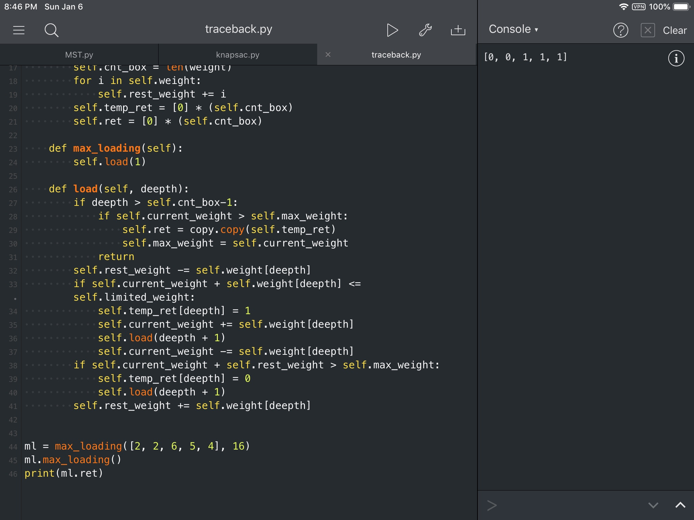

#  回溯法

###  一、问题描述

装载问题
- 有一批共n个集装箱要装上两艘载重量分别为 $c_1$和  $ c_2$的轮船。其中，集装箱i的重量为 $w_i$,且 $\sum_{i=n}^{n}w_i\leq c_1+c_2$。装载问题要求确定是否有一个合理的装载方案可将着n个集装箱装上着两艘轮船。如果有，找出一种装载方案

- 容易证明，如果第一个给定装载问题有解，则采用下面的策略可得到最优装载方案：

  1. 首先将第一艘轮船尽可能装满
  2. 将生于的集装箱装上第二艘船

- 将第一艘轮船尽可能装满等价于选区全体集装箱的一个子集，使该子集中集装箱重量之和最接近$c_1$。由此可知，装载问题等价于一下特殊的0-1背包问题。
  $$
  \begin{align}&
  max\sum_{i=1}^nw_ix_i\\&
  \sum_{i=1}^nw_ix_i\leq c_1\\&
  x_i\in \{0,1\},1\leq i\leq n
  \end{align}
  $$
  

### 二、问题分析

​    在用回溯法解决装载问题时，应该用子集树表示其解空间。约束函数$\sum_{i=1}^nw_ix_i\leq c_1$已经在问题描述中给出了，只需要剪去不满足约束条件的子树即可。在递归函数中，但$i>n$时，算法搜索至叶子结点，其相应的装载重量为cw。如果cw>bestw，则表示当前解优于最优解，对应的要更新bestw。在$i\leq n$时，当前扩展结点Z是子集树的内部结点，该节点有10（左右）两个子结点。当且仅当$cw+w[i]\leq c$时进入左子树，堆左子树递归搜索。其右子结点总是可行的，所以进入右子树的时候并不需要检查。

​    为了提高算法的效率，还需要引入上上界函数，直接剪掉不含最优解的子树。设Z是解空间第i层上的当前扩展结点。cw是当前载重量；bestw是当前最优载重量；r是剩余集装箱的重量，即$r=\sum_{j=i+1}^nw_i$。此时定义上界函数为cw+r。在以Z为根的子树中任意叶子结点所相应的载重量均不超过cw+r。因此$cw+r\leq bestw$时，可将Z的右子树减去。

​    最后，需要使用两个变量分别记录从根结点至当前结点的路径，以构造除最优解


###  三、算法流程

```flow
St=>start: 开始
Ed=>end: 回溯
ed=>end: 回溯

CondRet=>condition: 当前树的深度是否到达叶子结点
CondUpdate=>condition: current_weight是否比当前最优解的大
OpUpdateRet=>operation: 更新ret为current_ret
更新max_weight为current_weight
OpUpdateRest=>operation: 更新rest_weight
CondLeagl=>condition: 用约束函数检查加上
当前结点的重量后是否会超载
OpAddNode=>operation: 更新temp_ret[deepth]=1
current_weight+=weight[deepth]
向下搜索解空间
再把current_weight恢复以便回溯
CondiBest=>condition: 用上界函数检查是否有必要剪枝
OpSearchDeeper=>operation: 向下搜索解空间
OpTraceBack=>operation: 为了回溯 恢复rest_weight

St->CondRet
CondRet(yes)->CondUpdate(yes)->OpUpdateRet->Ed
CondUpdate(no)->Ed
CondRet(no)->OpUpdateRest->CondLeagl
CondLeagl(yes)->OpAddNode
CondLeagl(no,left)->CondiBest
CondiBest(no)->OpSearchDeeper
CondiBest(yes)->OpTraceBack->ed


```

|      变量      |           含义           |
| :------------: | :----------------------: |
|     weight     |   给定的集装箱重量列表   |
|    cnt_box     |       集装箱的个数       |
|    temp_ret    | 单条路径下的路径记录列表 |
| current_weight |         当前重量         |
|  rest_weight   |         剩余重量         |
|      ret       |        最优解路径        |
|   max_weight   |        最优解重量        |

### 四、实验结果

在测试程序中，我给出的测试数据如下

```python
max_loading([2, 2, 6, 5, 4], 16)
```

最后程序的输出结果为

```python
[0, 0, 1, 1, 1]
```

这表示要装入质量为6，5，4的这三个集装箱，刚好是16。所以验证实验结果是正确的


